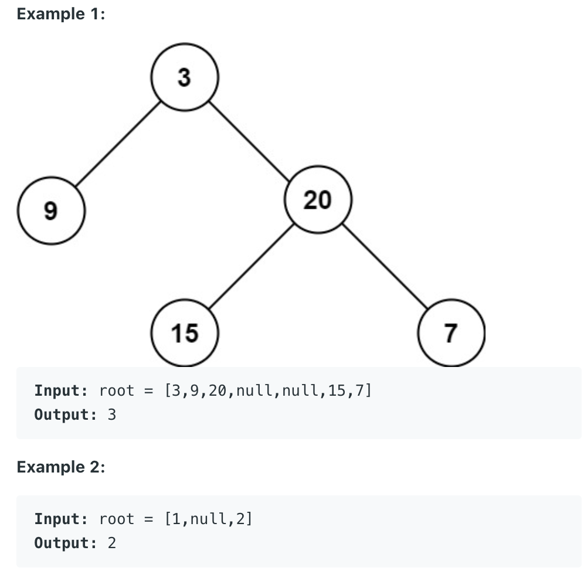
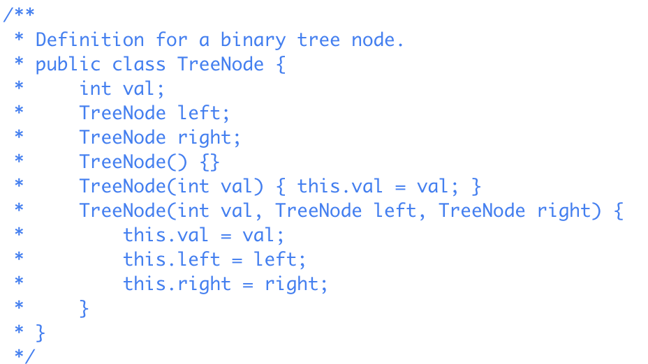

# Maximum Depth of Binary Tree

Given the *root* of a binary tree, return its maximum depth.

A binary tree's **maximum depth** is the number of nodes along the longest path from the root node down to the farthest leaf node.

DFS Recursive Approach

	public int maxDepth(TreeNode root){
		if(root == null) return 0;
		return 1 + Math.max(maxDepth(root.left), maxDepth(root.right);	
	}

DFS Iterative Approach
	
	int max = 0;
	public int maxDepth(TreeNode root){
		if (root == null) return 0;
		dfs(root, 0);
		return max;
	}

	public void dfs(TreeNode root, int level){
		max = Math.max(max, level);
		level++;
		if(root != null){
			dfs(root.left, level);
			dfs(root.right, level);
		}
	}

BFS Iterative Approach

	public int maxDepth(TreeNode root){
		if (root == null) return 0;

		Queue<TreeNode> q = new LinkedList();
		q.add(root);

		int level = 0;
		while (!q.isEmpty()){
			int size = q.size();
			for (int i = 0; i < size; i++){
				TreeNode node = q.poll();
				if(node.left != null){
					q.add(node.left);
				}
				if(node.rigt != null){
					q.add(node.right);
				}
			}
			level++;
		}
		return level;
	}

