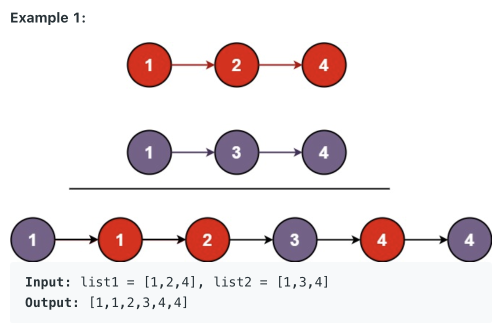

# Merge Two Sorted Lists

Given the heads of two sorted linked list l1 and l2. Merge two lists in a one sorted list. The list should be made by splicing together the nodes of the first two lists.

return the head of the merged linked list.

	public class ListNode{
		int val;
		ListNode next;
		ListNode(){}
		ListNode(int val){this.val = val;}
		ListNode(int val, ListNode next){this.val = val; this.next = next;}
	}

### Iterative Approach ###

    public ListNode mergeTwoLists(ListNode l1, ListNode l2) {
        // dummy head
        ListNode head = new ListNode();
        ListNode tail = head;
        
        while(l1 != null && l2 != null){
            if (l1.val < l2.val){
                tail.next = l1;
                l1 = l1.next;
            }else{
                tail.next = l2;
                l2 = l2.next;
            }
            tail = tail.next;
        }
        if (l1 != null){
            tail.next = l1;
        }else{
            tail.next = l2;
        }
        return head.next;
    }

### Recursive Approach ###

	public ListNode mergeTwoLists(ListNode l1, ListNode l2){
		// Base Case
		if (l1 == null) return l2;
		if (l2 == null) return l1;
		
		while (l1 != null && l2 != null){
			if (l1.val < l2.val){
				l1.next = mergerTwoLists(l1.next, l2);
				return l1;
			}else{
				l2.next = mergerTwoLists(l1, l2.next);
				return l2;
			}
		}
		return l1;
	}
