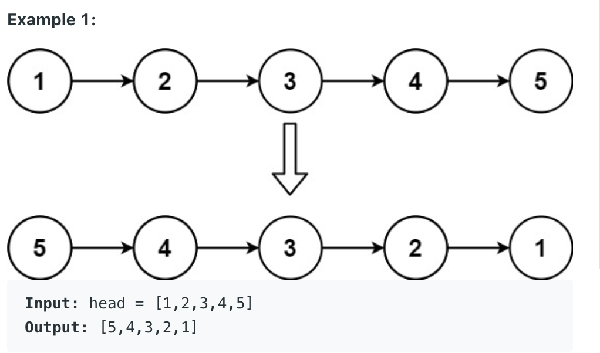
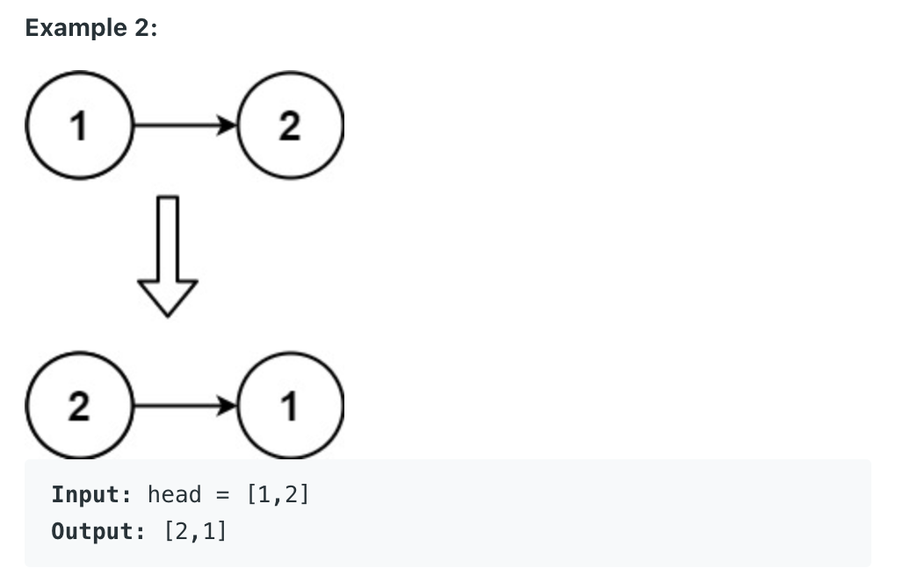

# Reverse Linked List

Given the head of a singly linked list, reverse the list, and return the reversed list

    public ListNode reverseList(ListNode head) {
        ListNode pre = null;
        // ListNode cur = head;
        
        while(head != null){
            ListNode next_node = head.next;
            head.next = pre;
            pre = head;
            head = next_node;
        }
        
        // ListNode res = new ListNode();
        return pre;
        
    }
