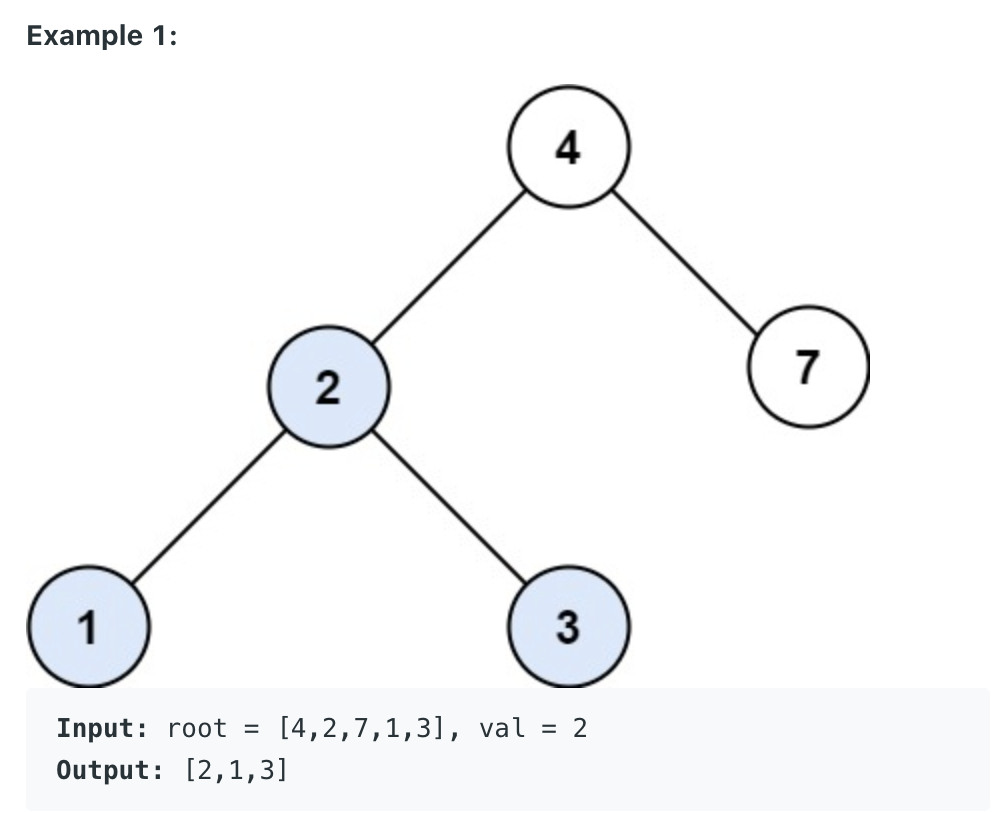
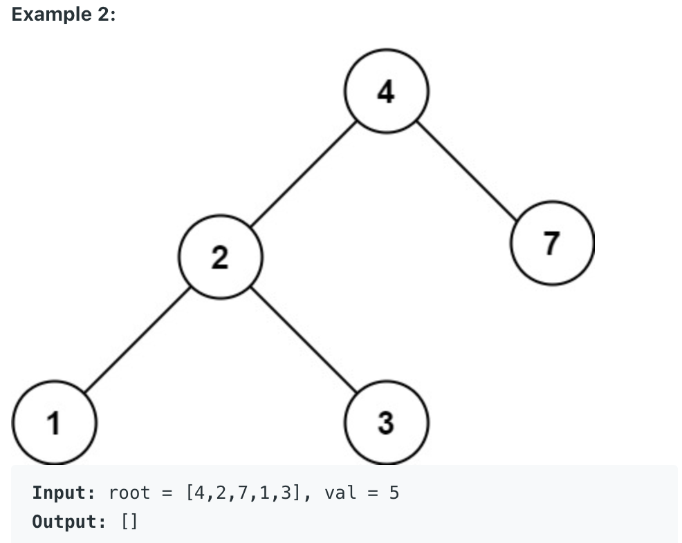

# Search in a Binary Search Tree

You are given the root of a binary tree (BST) and an integer val

Find the node in the BST that the node's value equals val and return the subtree rooted with that node. If such a node does not eixt, return null.

    public TreeNode searchBST(TreeNode root, int val) {
        if (root == null) return null;
        if (root.val == val) return root;
        if (val < root.val){
            return searchBST(root.left, val);
        }
        else{
            return searchBST(root.right, val);
        }
    } 
