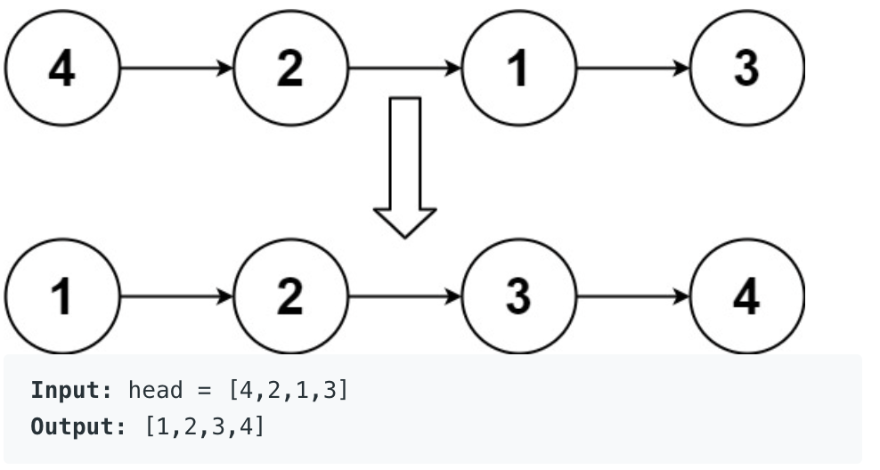

# Sort List

Given the head of a linked list, return the list after sorting it in ascending order.

Example:

    public ListNode sortList(ListNode head) {
       
        ListNode cur = head;
        List<Integer> list = new ArrayList();
        while (cur != null){
            list.add(cur.val);
            cur = cur.next;
        }
        cur = head;
        
        Collections.sort(list);
        for (int i : list){
            cur.val = i;
            cur = cur.next;
        }
        return head;
    }
       
