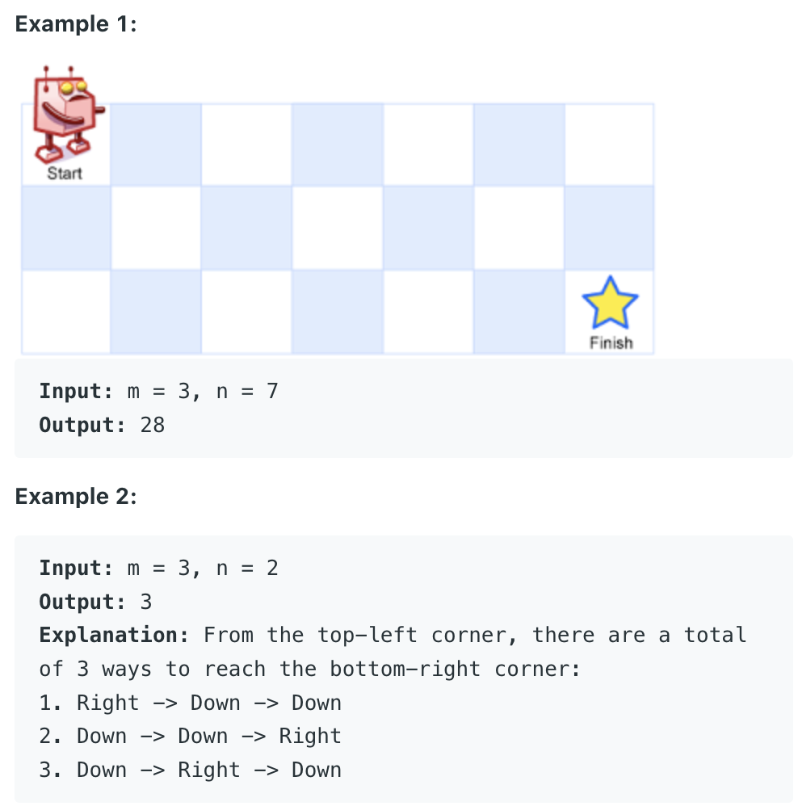

# Unique Paths

There is a robot on a *m x n* grid. The robot is initially located at the **top-left corner** (i.e., *grid[0][0]*). The robot tries to move to the **bottom-right corner** (i.e., *grid[m-1][n-1]*). The robot can only move either down or right at any point in time.

Given two integers m and n, return the number of possible unique paths that the robot can take to reach the bottom-right corner.

    public int uniquePaths(int m, int n) {
        int[][] dp = new int[m+1][n+1];
        dp[0][0] = 0;
        dp[0][1] = 1;
        
        for (int r = 1; r <= m; r++){
            for (int c = 1; c <= n; c++){
                dp[r][c] = dp[r-1][c] + dp[r][c-1];
            }
        }
        return dp[m][n];
    }
