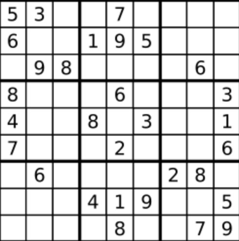

# Valid Sudoku

Determine if 9x9 Sudoku board is valid. Only the filled cells need to be validated according to the following rules:

Each row must contain the digits 1-9 without repetition

Each column must contain the digits 1-9 without repetition

Each of the nine 3x3 sub-boxed of the grid must contain the digits 1-9 without repetition

### Example:

Input: board = 

[["5","3",".",".","7",".",".",".","."]

,["6",".",".","1","9","5",".",".","."]

,[".","9","8",".",".",".",".","6","."]

,["8",".",".",".","6",".",".",".","3"]

,["4",".",".","8",".","3",".",".","1"]

,["7",".",".",".","2",".",".",".","6"]

,[".","6",".",".",".",".","2","8","."]

,[".",".",".","4","1","9",".",".","5"]

,[".",".",".",".","8",".",".","7","9"]]

Output: true

### HashSet Approach

	public boolean isValidSudoku(char[][] board){
		Set<Character>[] row = new HashSet[9];
		Set<Character>[] col = new HashSet[9];
		Set<Character>[] box = new HashSet[9];

		for (int i = 0; i < 9; i++){
			row[i] = new HashSet();
			col[i] = new HashSet();
			box[i] = new HashSet();
		}	

		for (int r = 0; r < 9; r++){
			for (int c = 0; c < 9; c++){
				char n = board[r][c];
				if (n == '.') continue;
				if (row[r].contains(n) || col[c].contains(n) || box[(r/3)*3+c/3].contains[n]){
					return false;
				}
				row[r].add(n);
				col[c].add(n);
				box[(r/3)*3+c/3].add(n);
			}
		}
		return true;
	}

Time Complexity: O(n^2) Space Complexity: O(n)

